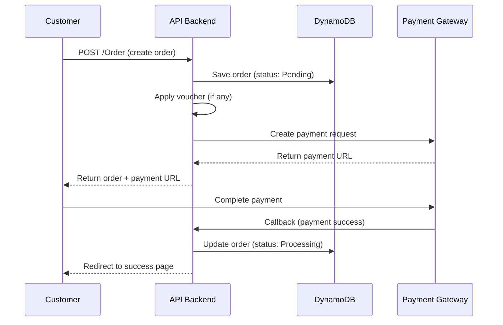
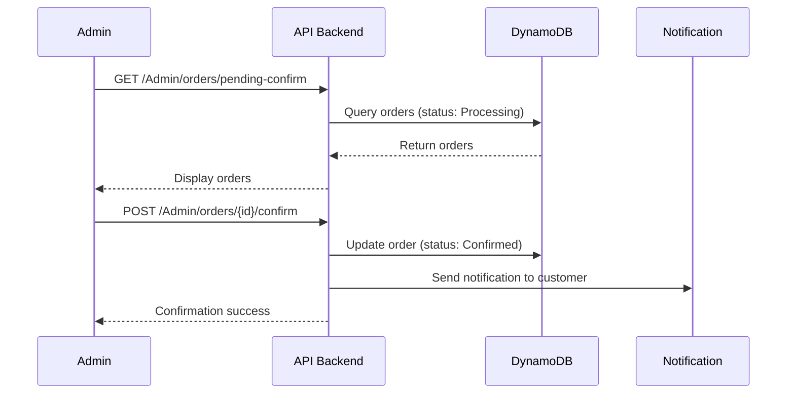
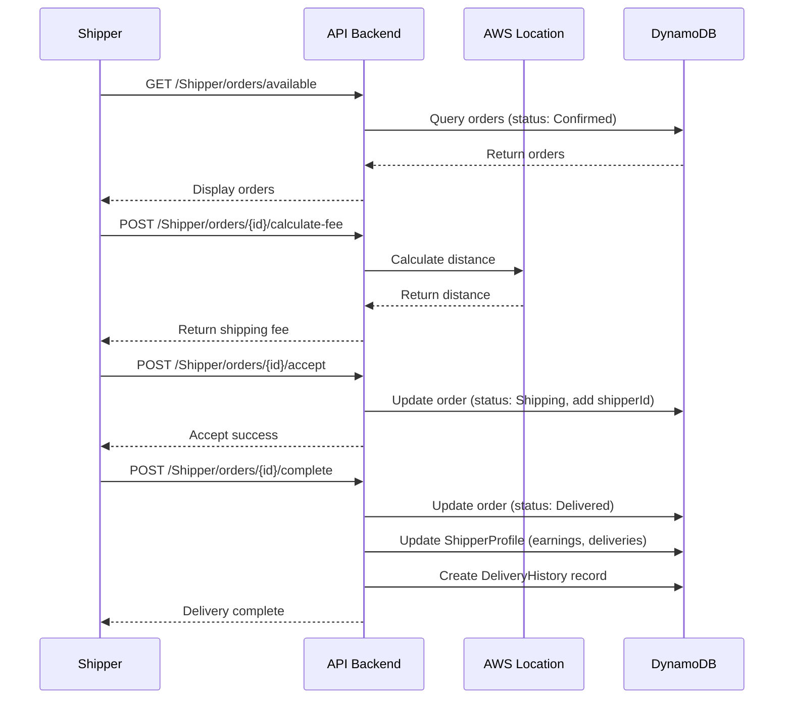
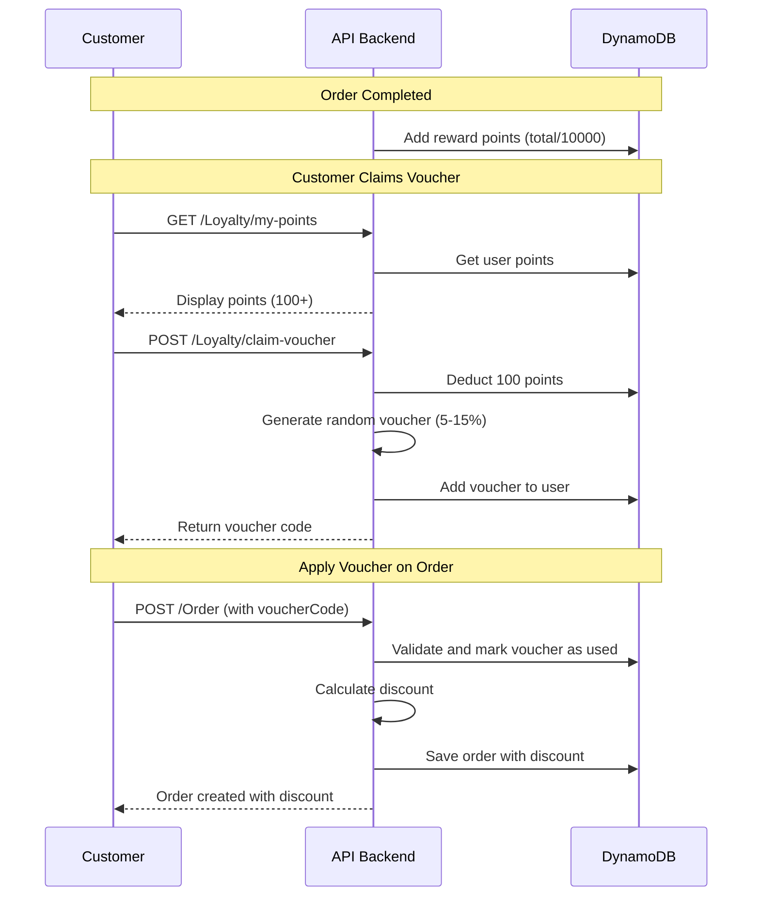

# ☕ Coffee Shop Order Platform - API Backend

[](https://dotnet.microsoft.com/download)
[](https://aws.amazon.com/)
[](https://aws.amazon.com/dynamodb/)
[](LICENSE)

Hệ thống đặt hàng và giao hàng cho quán cà phê, xây dựng với .NET 9.0, tích hợp AWS Services và hỗ trợ thanh toán điện tử.

---

## 📋 Mục lục

- [Tổng quan](#-tổng-quan)
- [Kiến trúc hệ thống](#-kiến-trúc-hệ-thống)
- [Tính năng chính](#-tính-năng-chính)
- [Công nghệ sử dụng](#-công-nghệ-sử-dụng)
- [Cài đặt](#-cài-đặt)
- [Cấu hình](#-cấu-hình)
- [API Endpoints](#-api-endpoints)
- [Workflow](#-workflow)
- [Database Schema](#-database-schema)
- [Authentication & Authorization](#-authentication--authorization)
- [Payment Integration](#-payment-integration)
- [Deployment](#-deployment)
- [Contributors](#-contributors)

---

## 🎯 Tổng quan

**Coffee Shop Order Platform** là một hệ thống quản lý đơn hàng và giao hàng toàn diện cho quán cà phê, cho phép:

- 👥 **Khách hàng** đặt hàng trực tuyến, thanh toán qua ví điện tử và nhận voucher
- 🛵 **Shipper** nhận đơn và giao hàng, quản lý thu nhập
- 👨‍💼 **Admin** quản lý sản phẩm, đơn hàng và duyệt shipper

### Điểm nổi bật

- ✅ **Hybrid Authentication**: AWS Cognito (Customer/Admin) + Local JWT (Shipper)
- ✅ **Real-time Distance Calculation**: AWS Location Service với fallback thông minh
- ✅ **Dual Payment Gateway**: VNPay và MoMo
- ✅ **Loyalty Program**: Hệ thống điểm thưởng và voucher
- ✅ **Email Notifications**: AWS SES cho thông báo tự động
- ✅ **Serverless Database**: DynamoDB cho khả năng scale cao

---

## 🏗️ Kiến trúc hệ thống

```
┌─────────────────────────────────────────────────────────────┐
│                      Frontend (React)                        │
│              localhost:3000 / Amplify Deploy                 │
└────────────────────┬────────────────────────────────────────┘
                     │ HTTPS/REST API
                     ▼
┌─────────────────────────────────────────────────────────────┐
│              ASP.NET Core 9.0 Web API                        │
│                   (Program.cs)                               │
├─────────────────────────────────────────────────────────────┤
│  Controllers Layer                                           │
│  • AuthController       • OrderController                    │
│  • ShipperController    • AdminController                    │
│  • PaymentController    • ProductController                  │
│  • LoyaltyController    • NotificationController             │
├─────────────────────────────────────────────────────────────┤
│  Services Layer                                              │
│  • AuthService          • OrderService                       │
│  • ShippingService      • LoyaltyService                     │
│  • VNPayService         • MoMoService                        │
│  • EmailService         • NotificationService                │
├─────────────────────────────────────────────────────────────┤
│  Repository Layer                                            │
│  • UserRepository       • OrderRepository                    │
│  • ProductRepository    • ShipperProfileRepository           │
│  • VoucherRepository    • NotificationRepository             │
└────────────────────┬────────────────────────────────────────┘
                     │
                     ▼
┌─────────────────────────────────────────────────────────────┐
│                    AWS Services                              │
├─────────────────────────────────────────────────────────────┤
│  • DynamoDB           - NoSQL Database                       │
│  • Cognito            - User Authentication (Customer/Admin) │
│  • SES                - Email Notifications                  │
│  • Location Service   - Geocoding & Route Calculation        │
│  • SNS                - Push Notifications                   │
│  • Amplify            - Frontend Hosting                     │
└─────────────────────────────────────────────────────────────┘
                     │
                     ▼
┌─────────────────────────────────────────────────────────────┐
│              External Services                               │
├─────────────────────────────────────────────────────────────┤
│  • VNPay              - Payment Gateway                      │
│  • MoMo               - E-Wallet Payment                     │
└─────────────────────────────────────────────────────────────┘
```

---

## ✨ Tính năng chính

### 🔐 Authentication & Authorization

#### Hybrid Auth System
- **AWS Cognito**: Dành cho Customer và Admin
  - Email verification
  - Password management
  - Token refresh
  
- **Local JWT**: Dành riêng cho Shipper
  - BCrypt password hashing
  - Custom JWT token generation
  - Role-based access control

#### User Roles
| Role     | Authentication | Permissions                                      |
|----------|----------------|--------------------------------------------------|
| Customer | AWS Cognito    | Đặt hàng, xem lịch sử, nhận voucher             |
| Admin    | AWS Cognito    | Quản lý sản phẩm, duyệt đơn, quản lý shipper    |
| Shipper  | Local JWT      | Nhận đơn, giao hàng, xem thu nhập               |

### 📦 Order Management

#### Order Status Flow
```
Pending → Processing → Confirmed → Shipping → Delivered → Completed
                  ↓
              Cancelled (có thể hủy ở Pending/Processing/Confirmed)
```

#### Features
- ✅ Tạo đơn hàng với nhiều sản phẩm (Drink/Cake) + Toppings
- ✅ Áp dụng voucher giảm giá tự động
- ✅ Tính phí ship dựa trên khoảng cách thực tế
- ✅ Chống duplicate order với `clientOrderId`
- ✅ Lịch sử đơn hàng với thống kê chi tiết
- ✅ Admin xác nhận đơn → Shipper nhận đơn → Giao hàng

### 💰 Payment Integration

#### Supported Payment Methods

1. **VNPay**
   - Thanh toán qua thẻ ATM/Visa/Mastercard
   - Sandbox mode cho testing
   - Secure signature validation
   - IPN (Instant Payment Notification) support

2. **MoMo**
   - E-wallet payment
   - QR Code payment
   - Deep link support (mobile app)
   - Automatic callback handling

3. **Cash** (Coming soon)
   - Thanh toán khi nhận hàng

### 🎁 Loyalty Program

#### Reward Points System
- **Tích điểm**: 1 điểm cho mỗi 10,000 VNĐ
- **Đổi voucher**: 100 điểm = 1 voucher (giảm 5-15%)
- **Voucher expiry**: 30 ngày kể từ ngày nhận

#### Voucher Features
- ✅ Tự động tạo mã voucher ngẫu nhiên (8 ký tự)
- ✅ Kiểm tra hợp lệ trước khi áp dụng
- ✅ Áp dụng voucher ngay khi tạo order
- ✅ Theo dõi voucher đã dùng/còn hạn/hết hạn

### 🚚 Shipping System

#### Distance Calculation
```
AWS Location Service (Primary)
    ↓ (on error)
Haversine Formula (Secondary)
    ↓ (on error)
Fallback Estimation (Final)
```

#### Shipping Fee Formula
```
Distance ≤ 3km:   15,000 VNĐ (base price)
Distance > 3km:   15,000 + (distance - 3) × 5,000 VNĐ
```

Example:
- 2km → 15,000 VNĐ
- 5km → 15,000 + (2 × 5,000) = 25,000 VNĐ
- 10km → 15,000 + (7 × 5,000) = 50,000 VNĐ

#### Shipper Features
- ✅ Xem danh sách đơn available
- ✅ Tính phí ship trước khi accept
- ✅ Nhận đơn và cập nhật trạng thái
- ✅ Xem lịch sử giao hàng và thống kê thu nhập
- ✅ Quản lý profile (vehicle, bank account)

### 👨‍💼 Admin Panel

#### Shipper Management
- ✅ Duyệt/từ chối đơn đăng ký shipper
- ✅ Tự động tạo mật khẩu và gửi email
- ✅ Khóa/mở khóa tài khoản shipper
- ✅ Reset mật khẩu shipper
- ✅ Xem thống kê shipper (deliveries, earnings, rating)

#### Order Management
- ✅ Xem danh sách đơn chờ xác nhận
- ✅ Xác nhận đơn hàng (Processing → Confirmed)
- ✅ Theo dõi trạng thái đơn hàng real-time
- ✅ Quản lý inventory và stock

#### Product Management
- ✅ CRUD operations cho Drinks, Cakes, Toppings
- ✅ Quản lý giá và availability
- ✅ Upload hình ảnh sản phẩm

### 📧 Notification System

#### Email Notifications (AWS SES)
- ✅ **Shipper approval**: Email với username + password
- ✅ **Shipper rejection**: Email với lý do từ chối
- ✅ **Password reset**: Email với mật khẩu mới
- ✅ **Order confirmation**: Email xác nhận đơn hàng

#### Push Notifications (AWS SNS) - Coming soon
- Order status updates
- Promotion notifications
- Delivery tracking

---

## 🛠️ Công nghệ sử dụng

### Backend
- **Framework**: ASP.NET Core 9.0 (Web API)
- **Language**: C# 12
- **Architecture**: Repository Pattern + Service Layer

### Database
- **Primary**: Amazon DynamoDB
  - `CoffeeShopUsers` - User accounts
  - `Orders` - Order management
  - `Products` - Product catalog
  - `ShipperProfiles` - Shipper details
  - `ShipperDeliveryHistory` - Delivery tracking
  - `Notifications` - Notification logs

### AWS Services
| Service           | Purpose                              |
|-------------------|--------------------------------------|
| DynamoDB          | NoSQL Database                       |
| Cognito           | User Authentication (Customer/Admin) |
| SES               | Email Service                        |
| Location Service  | Geocoding & Route Calculation        |
| SNS               | Push Notifications                   |
| Amplify           | Frontend Hosting                     |
| Lambda            | Serverless Functions (future)        |

### Third-party Integrations
- **VNPay**: Payment gateway
- **MoMo**: E-wallet payment
- **BCrypt.Net**: Password hashing
- **JWT**: Local authentication (Shipper)

### NuGet Packages
```xml
<PackageReference Include="AWSSDK.DynamoDBv2" Version="4.0.9.4" />
<PackageReference Include="AWSSDK.Extensions.NETCore.Setup" Version="4.0.3.9" />
<PackageReference Include="AWSSDK.LocationService" Version="4.0.3.4" />
<PackageReference Include="AWSSDK.SimpleEmail" Version="4.0.2.2" />
<PackageReference Include="AWSSDK.SimpleNotificationService" Version="4.0.2.5" />
<PackageReference Include="Amazon.Extensions.CognitoAuthentication" Version="3.1.1" />
<PackageReference Include="BCrypt.Net-Next" Version="4.0.3" />
<PackageReference Include="Microsoft.AspNetCore.Authentication.JwtBearer" Version="9.0.10" />
<PackageReference Include="Newtonsoft.Json" Version="13.0.4" />
<PackageReference Include="Swashbuckle.AspNetCore" Version="9.0.6" />
```

---

## 🚀 Cài đặt

### Prerequisites

- [.NET 9.0 SDK](https://dotnet.microsoft.com/download/dotnet/9.0)
- [AWS Account](https://aws.amazon.com/) (Free Tier eligible)
- [Visual Studio 2022](https://visualstudio.microsoft.com/) hoặc [Rider](https://www.jetbrains.com/rider/)
- AWS CLI (optional, for deployment)

### Bước 1: Clone repository

```bash
git clone https://github.com/yourusername/coffee-shop-order-platform.git
cd coffee-shop-order-platform
```

### Bước 2: Restore dependencies

```bash
dotnet restore
```

### Bước 3: Cấu hình AWS Credentials

**Option A: AWS CLI**
```bash
aws configure
```

**Option B: Environment Variables**
```bash
export AWS_ACCESS_KEY_ID=your_access_key
export AWS_SECRET_ACCESS_KEY=your_secret_key
export AWS_REGION=ap-southeast-1
```

**Option C: User Secrets (Recommended for development)**
```bash
dotnet user-secrets init
dotnet user-secrets set "AWS:AccessKey" "your_access_key"
dotnet user-secrets set "AWS:SecretKey" "your_secret_key"
```

### Bước 4: Setup DynamoDB Tables

Tables sẽ được tự động tạo khi chạy application lần đầu. Nếu muốn tạo thủ công:

```bash
# Via AWS CLI
aws dynamodb create-table --cli-input-json file://dynamo-schemas/CoffeeShopUsers.json
aws dynamodb create-table --cli-input-json file://dynamo-schemas/Orders.json
# ... (other tables)
```

### Bước 5: Setup AWS Cognito

1. Tạo User Pool trên AWS Cognito Console
2. Tạo App Client (không cần client secret)
3. Configure sign-up/sign-in settings
4. Copy `UserPoolId` và `ClientId` vào `appsettings.json`

### Bước 6: Setup Payment Gateways

#### VNPay (Sandbox)
1. Đăng ký tài khoản sandbox tại [VNPay Sandbox](https://sandbox.vnpayment.vn/)
2. Lấy `TmnCode` và `HashSecret`
3. Cập nhật vào `appsettings.json`

#### MoMo (Test Environment)
1. Đăng ký tài khoản test tại [MoMo Developer](https://developers.momo.vn/)
2. Lấy `PartnerCode`, `AccessKey`, `SecretKey`
3. Cập nhật vào `appsettings.json`

### Bước 7: Run application

```bash
dotnet run
```

Application sẽ chạy tại:
- **HTTP**: http://localhost:5144
- **HTTPS**: https://localhost:7144
- **Swagger**: http://localhost:5144/swagger

---

## ⚙️ Cấu hình

### appsettings.json Structure

```json
{
  "AWS": {
    "Region": "ap-southeast-1",
    "UserPoolId": "YOUR_COGNITO_POOL_ID",
    "ClientId": "YOUR_COGNITO_CLIENT_ID",
    "SES": {
      "FromEmail": "noreply@yourdomain.com",
      "ReplyToEmail": "support@yourdomain.com"
    },
    "Location": {
      "PlaceIndexName": "CoffeeShopPlaceIndex",
      "RouteCalculatorName": "CoffeeShopRouteCalculator"
    }
  },
  "Jwt": {
    "LocalKey": "YOUR_SECRET_KEY_32_CHARS_MINIMUM",
    "ExpiryMinutes": 60
  },
  "VNPay": {
    "Url": "https://sandbox.vnpayment.vn/paymentv2/vpcpay.html",
    "TmnCode": "YOUR_TMN_CODE",
    "HashSecret": "YOUR_HASH_SECRET",
    "ReturnUrl": "http://localhost:5144/api/Payment/vnpay/callback"
  },
  "MoMo": {
    "Endpoint": "https://test-payment.momo.vn/v2/gateway/api/create",
    "PartnerCode": "YOUR_PARTNER_CODE",
    "AccessKey": "YOUR_ACCESS_KEY",
    "SecretKey": "YOUR_SECRET_KEY",
    "ReturnUrl": "http://localhost:5144/api/MoMoPayment/callback",
    "NotifyUrl": "http://localhost:5144/api/MoMoPayment/ipn"
  },
  "Shipping": {
    "ShopAddress": "10.771479,106.704170",
    "BasePrice": 15000,
    "BaseDistance": 3,
    "PricePerKm": 5000,
    "UseAWSLocation": true
  },
  "Frontend": {
    "Development": "http://localhost:3000",
    "Production": "https://yourdomain.com"
  }
}
```

### Environment Variables

Để bảo mật, không commit sensitive data vào git. Sử dụng:

```bash
# Development
dotnet user-secrets set "AWS:AccessKey" "YOUR_KEY"
dotnet user-secrets set "VNPay:HashSecret" "YOUR_SECRET"

# Production (via environment variables)
export AWS__AccessKey=YOUR_KEY
export VNPay__HashSecret=YOUR_SECRET
```

---

## 📚 API Endpoints

### Base URL
```
Development: http://localhost:5144/api
Production:  https://your-domain.com/api
```

### Authentication

#### 🔓 Public Endpoints

| Method | Endpoint                           | Description                    |
|--------|------------------------------------|--------------------------------|
| POST   | `/Auth/register`                   | Đăng ký Customer/Admin         |
| POST   | `/Auth/login`                      | Đăng nhập (Hybrid auth)        |
| POST   | `/Auth/confirm`                    | Xác nhận email (Cognito)       |
| POST   | `/Auth/resend`                     | Gửi lại mã xác nhận            |
| POST   | `/ShipperRegistration/register`    | Đăng ký Shipper (guest)        |

#### 🔒 Protected Endpoints

| Method | Endpoint                           | Role    | Description                    |
|--------|------------------------------------|---------|--------------------------------|
| POST   | `/Auth/logout`                     | All     | Đăng xuất (Cognito)            |
| POST   | `/Auth/change-password`            | Shipper | Đổi mật khẩu (Shipper)         |
| GET    | `/Auth/whoami`                     | All     | Thông tin user hiện tại        |

### Orders

#### Customer Endpoints

| Method | Endpoint                           | Role     | Description                    |
|--------|------------------------------------|----------|--------------------------------|
| POST   | `/Order`                           | User     | Tạo đơn hàng mới               |
| GET    | `/Order/my-orders`                 | User     | Xem lịch sử đơn hàng           |
| GET    | `/Order/my-orders/{orderId}`       | User     | Xem chi tiết đơn hàng          |

#### Admin Endpoints

| Method | Endpoint                           | Role  | Description                    |
|--------|------------------------------------|-------|--------------------------------|
| GET    | `/Admin/orders/pending-confirm`    | Admin | Đơn chờ xác nhận               |
| POST   | `/Admin/orders/{orderId}/confirm`  | Admin | Xác nhận đơn hàng              |
| GET    | `/Admin/orders`                    | Admin | Tất cả đơn hàng                |
| PUT    | `/Order/{id}/status`               | Admin | Cập nhật trạng thái đơn        |

#### Shipper Endpoints

| Method | Endpoint                           | Role    | Description                    |
|--------|------------------------------------|---------|--------------------------------|
| GET    | `/Shipper/orders/available`        | Shipper | Đơn hàng available             |
| GET    | `/Shipper/orders/{orderId}`        | Shipper | Chi tiết đơn hàng              |
| POST   | `/Shipper/orders/{orderId}/calculate-fee` | Shipper | Tính phí ship      |
| POST   | `/Shipper/orders/{orderId}/accept` | Shipper | Nhận đơn hàng                  |
| POST   | `/Shipper/orders/{orderId}/complete` | Shipper | Hoàn thành giao hàng        |
| GET    | `/Shipper/orders/history`          | Shipper | Lịch sử đơn hàng               |
| GET    | `/Shipper/statistics`              | Shipper | Thống kê shipper               |

### Products

| Method | Endpoint                           | Role        | Description                    |
|--------|------------------------------------|-------------|--------------------------------|
| GET    | `/Product`                         | Public      | Danh sách sản phẩm             |
| GET    | `/Product/{id}`                    | Public      | Chi tiết sản phẩm              |
| POST   | `/Product`                         | Admin/Staff | Thêm sản phẩm                  |
| PUT    | `/Product/{id}`                    | Admin/Staff | Cập nhật sản phẩm              |
| DELETE | `/Product/{id}`                    | Admin/Staff | Xóa sản phẩm                   |

### Drinks, Cakes, Toppings

Similar structure to Products:
- `/Drink/*`
- `/Cake/*`
- `/Topping/*`

### Loyalty & Vouchers

| Method | Endpoint                           | Role | Description                    |
|--------|------------------------------------|------|--------------------------------|
| GET    | `/Loyalty/my-points`               | User | Xem điểm thưởng                |
| GET    | `/Loyalty/my-vouchers`             | User | Xem danh sách voucher          |
| POST   | `/Loyalty/claim-voucher`           | User | Nhận voucher (100 điểm)        |
| POST   | `/Loyalty/validate-voucher`        | User | Validate voucher trước khi dùng|

### Payment

| Method | Endpoint                           | Role | Description                    |
|--------|------------------------------------|------|--------------------------------|
| POST   | `/Payment/vnpay/create`            | User | Tạo link thanh toán VNPay      |
| GET    | `/Payment/vnpay/callback`          | Public | Callback từ VNPay           |
| GET    | `/Payment/vnpay/ipn`               | Public | IPN từ VNPay                |
| GET    | `/Payment/status/{orderId}`        | User | Kiểm tra trạng thái thanh toán |
| POST   | `/MoMoPayment/create`              | User | Tạo link thanh toán MoMo       |
| GET    | `/MoMoPayment/callback`            | Public | Callback từ MoMo            |
| POST   | `/MoMoPayment/ipn`                 | Public | IPN từ MoMo                 |

### Shipper Management (Admin)

| Method | Endpoint                           | Role  | Description                    |
|--------|------------------------------------|-------|--------------------------------|
| GET    | `/Admin/shippers/pending`          | Admin | Shipper chờ duyệt              |
| GET    | `/Admin/shippers`                  | Admin | Danh sách shipper đã duyệt     |
| POST   | `/Admin/shipper/{userId}/approve`  | Admin | Duyệt shipper                  |
| POST   | `/Admin/shipper/{userId}/reject`   | Admin | Từ chối shipper                |
| PUT    | `/Admin/shipper/{userId}/lock`     | Admin | Khóa/mở khóa shipper           |
| POST   | `/Admin/shipper/{userId}/reset-password` | Admin | Reset mật khẩu shipper   |

### Shipper Profile

| Method | Endpoint                           | Role    | Description                    |
|--------|------------------------------------|---------|--------------------------------|
| GET    | `/Shipper/profile`                 | Shipper | Xem profile                    |
| PUT    | `/Shipper/profile`                 | Shipper | Cập nhật profile               |
| GET    | `/Shipper/history`                 | Shipper | Lịch sử giao hàng              |

---

## 🔄 Workflow

### 1. Customer Order Flow



### 2. Admin Confirm Flow



### 3. Shipper Delivery Flow



### 4. Loyalty Program Flow



---

## 🗄️ Database Schema

### CoffeeShopUsers

| Field                | Type     | Description                      |
|----------------------|----------|----------------------------------|
| UserId (PK)          | String   | Cognito sub hoặc GUID            |
| Username             | String   | Email hoặc username              |
| Role                 | String   | User/Admin/Shipper               |
| PasswordHash         | String   | BCrypt hash (Shipper only)       |
| IsActive             | Boolean  | Trạng thái hoạt động             |
| RegistrationStatus   | String   | Pending/Approved/Rejected        |
| RewardPoints         | Integer  | Điểm thưởng (User)               |
| AvailableVouchers    | List     | Danh sách voucher                |
| FullName             | String   | Họ tên                           |
| Email                | String   | Email                            |
| PhoneNumber          | String   | Số điện thoại                    |
| VehicleType          | String   | Loại xe (Shipper)                |
| LicensePlate         | String   | Biển số xe (Shipper)             |
| ApprovedAt           | DateTime | Thời gian duyệt                  |
| ApprovedBy           | String   | Admin UserId                     |
| CreatedAt            | DateTime | Thời gian tạo                    |

### Orders

| Field                | Type     | Description                      |
|----------------------|----------|----------------------------------|
| OrderId (PK)         | String   | GUID                             |
| UserId               | String   | Customer UserId                  |
| Items                | List     | Danh sách OrderItem              |
| TotalPrice           | Decimal  | Tổng tiền trước giảm giá         |
| FinalPrice           | Decimal  | Tổng tiền sau giảm giá           |
| AppliedVoucherCode   | String   | Mã voucher đã dùng               |
| Status               | String   | Order status                     |
| PaymentMethod        | String   | MoMo/VNPay/Cash                  |
| ShipperId            | String   | Shipper UserId                   |
| DeliveryAddress      | String   | Địa chỉ giao hàng                |
| DeliveryPhone        | String   | SĐT nhận hàng                    |
| DeliveryNote         | String   | Ghi chú giao hàng                |
| ShippingFee          | Decimal  | Phí ship                         |
| DistanceKm           | Decimal  | Khoảng cách (km)                 |
| ClientOrderId        | String   | FE generated ID (anti-duplicate) |
| CreatedAt            | DateTime | Thời gian tạo                    |
| ConfirmedAt          | DateTime | Thời gian admin confirm          |
| ConfirmedBy          | String   | Admin UserId                     |
| ShippingAt           | DateTime | Thời gian shipper accept         |
| DeliveredAt          | DateTime | Thời gian giao xong              |
| CompletedAt          | DateTime | Thời gian hoàn tất               |

### OrderItem

| Field          | Type     | Description                      |
|----------------|----------|----------------------------------|
| ProductId      | String   | Drink/Cake ID                    |
| ProductType    | String   | Drink/Cake                       |
| ProductName    | String   | Tên sản phẩm                     |
| Quantity       | Integer  | Số lượng                         |
| UnitPrice      | Decimal  | Đơn giá                          |
| TotalPrice     | Decimal  | Thành tiền                       |
| Toppings       | List     | Danh sách OrderTopping           |

### Products / Drinks / Cakes

| Field          | Type     | Description                      |
|----------------|----------|----------------------------------|
| ProductId (PK) | String   | GUID                             |
| Name           | String   | Tên sản phẩm                     |
| Price          | Decimal  | Giá                              |
| Description    | String   | Mô tả                            |
| ImageUrl       | String   | URL hình ảnh                     |
| Category       | String   | Phân loại                        |
| IsAvailable    | Boolean  | Còn hàng                         |
| StockQuantity  | Integer  | Số lượng tồn kho                 |

### Toppings

| Field          | Type     | Description                      |
|----------------|----------|----------------------------------|
| ToppingId (PK) | String   | GUID                             |
| Name           | String   | Tên topping                      |
| Price          | Decimal  | Giá                              |
| IsAvailable    | Boolean  | Còn hàng                         |

### ShipperProfile

| Field            | Type     | Description                      |
|------------------|----------|----------------------------------|
| ShipperId (PK)   | String   | User UserId                      |
| FullName         | String   | Họ tên                           |
| Phone            | String   | Số điện thoại                    |
| Email            | String   | Email                            |
| VehicleType      | String   | Loại xe                          |
| VehiclePlate     | String   | Biển số                          |
| BankAccount      | String   | Số tài khoản                     |
| BankName         | String   | Tên ngân hàng                    |
| TotalDeliveries  | Integer  | Số đơn đã giao                   |
| TotalEarnings    | Decimal  | Tổng thu nhập                    |
| Rating           | Decimal  | Đánh giá (0-5)                   |
| LastActiveAt     | DateTime | Lần hoạt động cuối               |

### ShipperDeliveryHistory

| Field          | Type     | Description                      |
|----------------|----------|----------------------------------|
| HistoryId (PK) | String   | GUID                             |
| ShipperId      | String   | Shipper UserId                   |
| OrderId        | String   | Order ID                         |
| AcceptedAt     | DateTime | Thời gian nhận đơn               |
| CompletedAt    | DateTime | Thời gian giao xong              |
| ShippingFee    | Decimal  | Phí ship nhận được               |
| DistanceKm     | Decimal  | Khoảng cách                      |

### Voucher (Nested in User)

| Field            | Type     | Description                      |
|------------------|----------|----------------------------------|
| Code             | String   | Mã voucher (8 ký tự)             |
| DiscountValue    | Decimal  | Giá trị giảm giá (0.05 - 0.15)   |
| ExpirationDate   | DateTime | Ngày hết hạn                     |
| IsUsed           | Boolean  | Đã sử dụng chưa                  |
| IsActive         | Boolean  | Còn hiệu lực                     |

---

## 🔐 Authentication & Authorization

### Hybrid Authentication System

```csharp
// Program.cs configuration
builder.Services.AddAuthentication(JwtBearerDefaults.AuthenticationScheme)
    // Cognito JWT for Customer/Admin
    .AddJwtBearer(JwtBearerDefaults.AuthenticationScheme, options => { ... })
    // Local JWT for Shipper
    .AddJwtBearer("ShipperAuth", options => { ... });
```

### Token Examples

#### Cognito ID Token (Customer/Admin)
```json
{
  "sub": "a1b2c3d4-...",
  "cognito:username": "customer@email.com",
  "custom:role": "User",
  "email": "customer@email.com",
  "email_verified": true,
  "exp": 1700000000
}
```

#### Local JWT (Shipper)
```json
{
  "nameid": "shipper-uuid",
  "unique_name": "shipper@email.com",
  "role": "Shipper",
  "exp": 1700000000
}
```

### Authorization Usage

```csharp
// Only Cognito authenticated users
[Authorize(Roles = "User,Admin")]

// Only local JWT authenticated shippers
[Authorize(AuthenticationSchemes = "ShipperAuth", Roles = "Shipper")]

// Allow both authentication schemes
[Authorize] // Uses default policy (both schemes allowed)
```

### Password Security

- **Cognito Users**: Managed by AWS Cognito (min 8 chars, complexity rules)
- **Shipper Users**: BCrypt hashing with automatic salt generation

```csharp
// BCrypt password hashing
var passwordHash = BCrypt.Net.BCrypt.HashPassword(password);
var isValid = BCrypt.Net.BCrypt.Verify(password, passwordHash);
```

---

## 💳 Payment Integration

### VNPay Integration

#### Payment Request Flow
```
1. Customer creates order → Backend creates payment URL
2. Customer redirects to VNPay → Enters payment info
3. VNPay processes payment → Redirects to ReturnUrl
4. Backend validates signature → Updates order status
5. VNPay sends IPN → Backend confirms (prevents missing callbacks)
```

#### Security
- **HMAC SHA512** signature validation
- Secure hash secret (never exposed to client)
- IPN (Instant Payment Notification) for redundancy

#### Example Request
```csharp
var vnpayData = new Dictionary<string, string>
{
    {"vnp_Version", "2.1.0"},
    {"vnp_Command", "pay"},
    {"vnp_TmnCode", _tmnCode},
    {"vnp_Amount", (amount * 100).ToString()},
    {"vnp_OrderInfo", $"Order {orderId}"},
    {"vnp_ReturnUrl", _returnUrl},
    {"vnp_IpAddr", ipAddress},
    {"vnp_CreateDate", DateTime.Now.ToString("yyyyMMddHHmmss")},
    // ... more fields
};
// Sign with SHA512
var signature = CreateSignature(vnpayData, _hashSecret);
```

### MoMo Integration

#### Payment Request Flow
```
1. Customer creates order → Backend creates payment request
2. Backend receives payUrl + qrCodeUrl + deepLink
3. Customer scans QR or clicks deepLink → MoMo app opens
4. Customer confirms payment → MoMo processes
5. MoMo redirects to ReturnUrl
6. MoMo sends IPN → Backend updates order
```

#### Features
- **QR Code Payment**: For desktop users
- **Deep Link**: Opens MoMo app on mobile
- **IPN Support**: Server-to-server notification

#### Example Request
```csharp
var momoRequest = new
{
    partnerCode = _partnerCode,
    accessKey = _accessKey,
    requestId = Guid.NewGuid().ToString(),
    amount = amount,
    orderId = orderId,
    orderInfo = $"Thanh toan don hang {orderId}",
    redirectUrl = _returnUrl,
    ipnUrl = _notifyUrl,
    requestType = "captureWallet",
    extraData = "",
    signature = GenerateSignature(...) // HMAC SHA256
};
```

### Payment Callback Handling

```csharp
// VNPay Callback
[HttpGet("vnpay/callback")]
public async Task<IActionResult> VNPayCallback()
{
    // 1. Validate signature
    var isValid = _vnPayService.ValidateSignature(Request.Query);
    if (!isValid) return BadRequest("Invalid signature");
    
    // 2. Update order status
    await _orderService.UpdateStatusAsync(orderId, "Processing");
    
    // 3. Redirect to frontend
    return Redirect($"{frontendUrl}/payment-success?orderId={orderId}");
}

// MoMo IPN (Server-to-server)
[HttpPost("momo/ipn")]
public async Task<IActionResult> MoMoIPN([FromBody] MoMoIPNRequest request)
{
    // 1. Validate signature
    var isValid = _momoService.ValidateSignature(request);
    if (!isValid) return Ok(new { resultCode = 97 });
    
    // 2. Update order (idempotent)
    await _orderService.UpdateStatusAsync(request.orderId, "Processing");
    
    // 3. Respond to MoMo
    return Ok(new { resultCode = 0, message = "Success" });
}
```

---

## 🚀 Deployment

### Deploy to AWS

#### Option 1: AWS Elastic Beanstalk

```bash
# Install EB CLI
pip install awsebcli

# Initialize
eb init -p "64bit Amazon Linux 2 v2.5.0 running .NET Core" coffee-shop-api

# Create environment
eb create coffee-shop-prod --instance-type t3.small

# Deploy
dotnet publish -c Release
eb deploy
```

#### Option 2: AWS Lambda + API Gateway

```bash
# Install Lambda tools
dotnet tool install -g Amazon.Lambda.Tools

# Deploy
cd CoffeeShopAPI
dotnet lambda deploy-serverless
```

#### Option 3: Docker + ECS

```dockerfile
# Dockerfile
FROM mcr.microsoft.com/dotnet/aspnet:9.0 AS base
WORKDIR /app
EXPOSE 80

FROM mcr.microsoft.com/dotnet/sdk:9.0 AS build
WORKDIR /src
COPY ["CoffeeShopAPI.csproj", "./"]
RUN dotnet restore
COPY . .
RUN dotnet publish -c Release -o /app/publish

FROM base AS final
WORKDIR /app
COPY --from=build /app/publish .
ENTRYPOINT ["dotnet", "CoffeeShopAPI.dll"]
```

```bash
# Build and push
docker build -t coffee-shop-api .
docker tag coffee-shop-api:latest 123456789012.dkr.ecr.ap-southeast-1.amazonaws.com/coffee-shop-api:latest
docker push 123456789012.dkr.ecr.ap-southeast-1.amazonaws.com/coffee-shop-api:latest

# Deploy to ECS
aws ecs update-service --cluster coffee-shop-cluster --service api-service --force-new-deployment
```

### Environment Configuration

**Production checklist:**

- ✅ Use AWS Secrets Manager or Parameter Store for secrets
- ✅ Enable HTTPS only
- ✅ Configure CORS for production frontend domain
- ✅ Set `Environment=Production` in appsettings
- ✅ Enable CloudWatch logging
- ✅ Configure auto-scaling
- ✅ Setup health check endpoint
- ✅ Use production payment gateway credentials

### CI/CD Pipeline (GitHub Actions)

```yaml
# .github/workflows/deploy.yml
name: Deploy to AWS

on:
  push:
    branches: [ main ]

jobs:
  deploy:
    runs-on: ubuntu-latest
    steps:
      - uses: actions/checkout@v2
      
      - name: Setup .NET
        uses: actions/setup-dotnet@v1
        with:
          dotnet-version: '9.0.x'
      
      - name: Restore dependencies
        run: dotnet restore
      
      - name: Build
        run: dotnet build --configuration Release
      
      - name: Test
        run: dotnet test --no-build --verbosity normal
      
      - name: Publish
        run: dotnet publish -c Release -o ./publish
      
      - name: Deploy to AWS Elastic Beanstalk
        uses: einaregilsson/beanstalk-deploy@v21
        with:
          aws_access_key: ${{ secrets.AWS_ACCESS_KEY_ID }}
          aws_secret_key: ${{ secrets.AWS_SECRET_ACCESS_KEY }}
          application_name: coffee-shop-api
          environment_name: coffee-shop-prod
          version_label: ${{ github.sha }}
          region: ap-southeast-1
          deployment_package: ./publish
```

---

## 📊 Monitoring & Logging

### CloudWatch Integration

```csharp
// Program.cs
builder.Logging.AddAWSProvider(builder.Configuration.GetAWSLoggingConfigSection());
```

### Application Insights

```csharp
// Custom logging
_logger.LogInformation("Order {OrderId} created by user {UserId}", orderId, userId);
_logger.LogError(ex, "Payment failed for order {OrderId}", orderId);
```

### Metrics to Monitor

- API response time
- Order creation rate
- Payment success rate
- Shipper acceptance time
- Average delivery time
- DynamoDB read/write capacity
- Lambda invocations (if using serverless)

---

## 🧪 Testing

### Unit Tests

```bash
# Run all tests
dotnet test

# Run with coverage
dotnet test /p:CollectCoverage=true
```

### API Testing with Swagger

1. Navigate to `http://localhost:5144/swagger`
2. Click "Authorize" button
3. Enter JWT token (Cognito ID token or local JWT)
4. Test endpoints interactively

### Postman Collection

Import the Postman collection from `CoffeeShopAPI.http` or create one with:

```http
### Login (Customer/Admin)
POST http://localhost:5144/api/Auth/login
Content-Type: application/json

{
  "username": "customer@email.com",
  "password": "YourPassword123"
}

### Login (Shipper)
POST http://localhost:5144/api/Auth/login
Content-Type: application/json

{
  "username": "shipper@email.com",
  "password": "ShipperPassword123"
}

### Create Order
POST http://localhost:5144/api/Order
Authorization: Bearer {{idToken}}
Content-Type: application/json

{
  "deliveryAddress": "123 Main St, District 1, HCMC",
  "deliveryPhone": "0912345678",
  "paymentMethod": "MoMo",
  "voucherCode": "ABC12345",
  "items": [
    {
      "productId": "drink-001",
      "productType": "Drink",
      "quantity": 2,
      "toppingIds": ["topping-001", "topping-002"]
    }
  ]
}
```

---

## 🐛 Troubleshooting

### Common Issues

#### 1. AWS Credentials Not Found
```
Error: Unable to get IAM security credentials from EC2 Instance Metadata Service
```
**Solution**: Configure AWS credentials via `aws configure` or environment variables

#### 2. DynamoDB Table Not Found
```
Error: Requested resource not found: Table: CoffeeShopUsers not found
```
**Solution**: Tables are auto-created on first run. Wait a few seconds and retry.

#### 3. JWT Token Invalid
```
Error: IDX10223: Lifetime validation failed. The token is expired.
```
**Solution**: Token expired. Re-login to get new token.

#### 4. VNPay Signature Mismatch
```
Error: Invalid signature
```
**Solution**: Check `HashSecret` matches your VNPay account settings

#### 5. AWS Location Service Error
```
Error: User: arn:aws:iam::xxx is not authorized to perform: geo:SearchPlaceIndexForText
```
**Solution**: Add `AmazonLocationFullAccess` policy to your IAM user/role

#### 6. CORS Error
```
Error: No 'Access-Control-Allow-Origin' header is present
```
**Solution**: Add frontend domain to `AllowAll` CORS policy in Program.cs

---

## 📄 API Documentation

### Swagger UI
Access interactive API documentation at:
- **Development**: http://localhost:5144/swagger
- **Production**: https://your-domain.com/swagger

### Authentication in Swagger
1. Click "Authorize" 🔒 button
2. Enter token in format: `Bearer YOUR_JWT_TOKEN`
3. Click "Authorize"
4. Test protected endpoints

### Response Formats

#### Success Response
```json
{
  "message": "Order created successfully",
  "order": {
    "orderId": "abc-123",
    "status": "Pending",
    "totalPrice": 100000,
    "finalPrice": 85000
  }
}
```

#### Error Response
```json
{
  "error": "Voucher không tồn tại hoặc đã được sử dụng"
}
```

---

## 🤝 Contributing

We welcome contributions! Please follow these guidelines:

### Development Workflow

1. **Fork** the repository
2. **Create** a feature branch (`git checkout -b feature/AmazingFeature`)
3. **Commit** your changes (`git commit -m 'Add some AmazingFeature'`)
4. **Push** to the branch (`git push origin feature/AmazingFeature`)
5. **Open** a Pull Request

### Code Style

- Follow C# coding conventions
- Use meaningful variable names
- Add XML comments to public methods
- Write unit tests for new features

### Pull Request Checklist

- [ ] Code builds without errors
- [ ] All tests pass
- [ ] New features have tests
- [ ] Documentation updated
- [ ] No sensitive data committed

---

## 📝 License

This project is licensed under the MIT License - see the [LICENSE](LICENSE) file for details.

---

## 👥 Contributors

- **Your Name** - *Initial work* - [@yourusername](https://github.com/yourusername)

See also the list of [contributors](https://github.com/yourusername/coffee-shop-order-platform/contributors) who participated in this project.

---

## 🙏 Acknowledgments

- AWS for free tier services
- VNPay and MoMo for sandbox environments
- .NET Community for awesome libraries
- Coffee ☕ for keeping developers awake

---

## 📧 Contact & Support

- **Email**: support@yourdomain.com
- **Website**: https://yourdomain.com
- **Issues**: https://github.com/yourusername/coffee-shop-order-platform/issues
- **Discussions**: https://github.com/yourusername/coffee-shop-order-platform/discussions

---

## 🗺️ Roadmap

### Phase 1 (Current) ✅
- [x] Basic order management
- [x] Hybrid authentication
- [x] Payment integration (VNPay, MoMo)
- [x] Loyalty program
- [x] Shipper management
- [x] AWS Location Service integration

### Phase 2 (In Progress) 🚧
- [ ] Real-time order tracking
- [ ] Push notifications (AWS SNS)
- [ ] Order rating & reviews
- [ ] Advanced analytics dashboard
- [ ] Inventory management
- [ ] Multi-store support

### Phase 3 (Planned) 📋
- [ ] Mobile apps (iOS/Android)
- [ ] AI-powered recommendations
- [ ] Chatbot support
- [ ] Subscription plans
- [ ] Referral program
- [ ] International payment methods

---

## 📊 Project Statistics

- **Lines of Code**: ~15,000+
- **API Endpoints**: 50+
- **Database Tables**: 8
- **AWS Services**: 6
- **Third-party Integrations**: 2
- **Authentication Methods**: 2 (Hybrid)

---

## 🎓 Learning Resources

### AWS Services
- [DynamoDB Documentation](https://docs.aws.amazon.com/dynamodb/)
- [AWS Cognito Guide](https://docs.aws.amazon.com/cognito/)
- [AWS Location Service](https://docs.aws.amazon.com/location/)

### .NET Core
- [ASP.NET Core Documentation](https://docs.microsoft.com/aspnet/core/)
- [C# Programming Guide](https://docs.microsoft.com/dotnet/csharp/)

### Payment Gateways
- [VNPay API Documentation](https://sandbox.vnpayment.vn/apis/)
- [MoMo API Documentation](https://developers.momo.vn/)

---

**Happy Coding! ☕💻**

*Built with ❤️ using .NET 9.0 and AWS*

